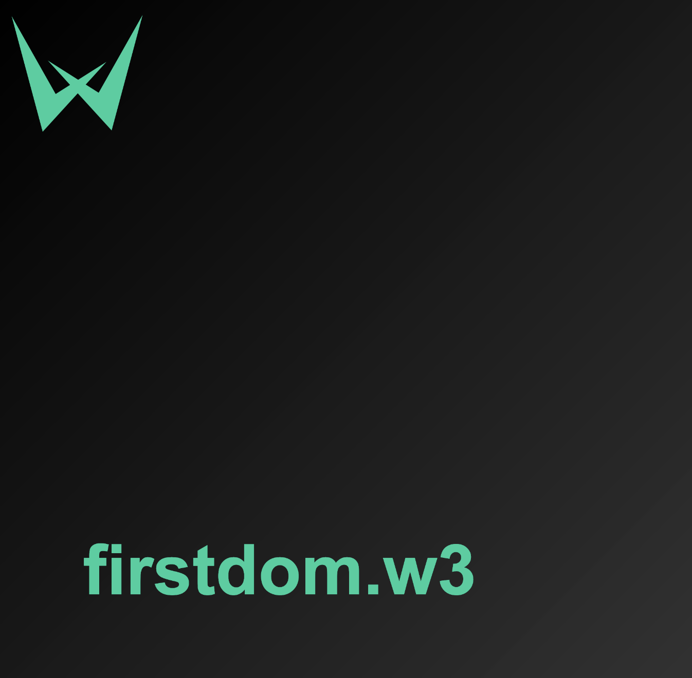

# 100% Decentralized

**W3UP Domains** is a 100% on-chain protocol ➜ `.w3` Domains are fully decentralized.

### On-chain Domain

Information about which address owns (or resolves to) a domain name is written to the blockchain.

This may seem self-evident for web3 projects, but there are also projects that present themselves as blockchain name services, but actually store the mapping between domain names and addresses on a central server.

A typical Web3 domain service will usually provide you with a domain name in the form of an NFT. 

While NFTs exist on the blockchain, an important part of NFTs is often hosted off-chain (e.g. on a central server): **metadata**.

### On-chain Metadata

The **NFT metadata** usually include the following data:

- Name
- Image
- Description

➜ There may be other data (like attributes/rarity), but in the context of the domain, the above three are the most important.

The metadata can be stored on three different places:

- **On-chain** (on the blockchain where NFT exists, usually in the same smart contract).
- On a **decentralized storage** system such as IPFS and Arweave.
- On a **centralized server**.

Obviously, ***it's best to store metadata on-chain***, meaning **it stays there forever** and **no one can change it**. 

1. **Centralized server**:

⚠️: ***The worst place to store metadata is a central server, the owner of that server can modify or even completely delete the data***. 

It can also happen that a server fails and is unavailable for a period of time, or a hard drive without a backup goes bad (data lost forever). 

2. **IPFS or Arweave**:

Somewhere in the middle, the metadata is hosted on [IPFS](https://ipfs.io/) or [Arweave](https://www.arweave.org/). 

⚠️: ***In this case it is important that the web3 domain service pays for the constant availability of metadata***. 

Otherwise, the metadata could become inaccessible for a period of time, or even disappear from the system entirely. (if no IPFS nodes have an incentive to keep this data, why would they keep it?) 

Usually the creator of the NFT reserves the right to delete the IPFS ➜ Change The base rights the URL in their NFT contract, which means they can change and possibly steal your NFT's metadata (the token ID will remain the same, but the name, image, attributes, etc. data will be completely different). 

➜ In this case, IPFS storage is no better than a central server.

✅ So, it is very important to keep all data **100% on-chain**, and this is exactly what [W3UP](https://app.w3up.cc/) do.

**How to find out where NFT metadata is stored?**

The easiest way is to go to the NFT contract on a block explorer and find the **Read section**. This section includes all functions that help you read data stored in a smart contract. 

Then find a function called `tokenURI` and enter some random token ID in it (for example: `1`). And then observe what data do you get back.

A) If you get back a URL that starts with `http`, the metadata is hosted on a **centralized server**.

B) If you get back a URL that starts with `ipfs`, then the metadata is stored on **IPFS**. In that case also check whether the contract has a function called `setBaseURI` (or similar) in the **Write section**. This would allow the NFT project creator to change the IPFS URL and change your metadata (like change the NFT name or image).

C) But if you get data that starts with `string: data:application/json;base64` and after that some big chunk of text that looks like "giberish" (`eyJuYW1lIjogIm5mdC...`), it's very likely **on-chain** metadata that is encoded in a format called [base64](https://www.base64decode.org/).

### On-chain Data

With some Domains Names Services, you can add other data to your domain besides the associated address. Such data may include things like homepage URLs, Twitter handles, emails, phone numbers, profile pictures, and more. 

➜ Adding this additional data is completely optional to be stored on-chain.

Storing other data on-chain may not be as important as storing metadata and domain names, but it's still better than storing it off-chain.

➜ [W3UP](https://w3up.cc) will offer this possibility soon for an [IPFS website](./ipfs.md). (To stay informed, follow the [roadmap](./roadmap.md).)